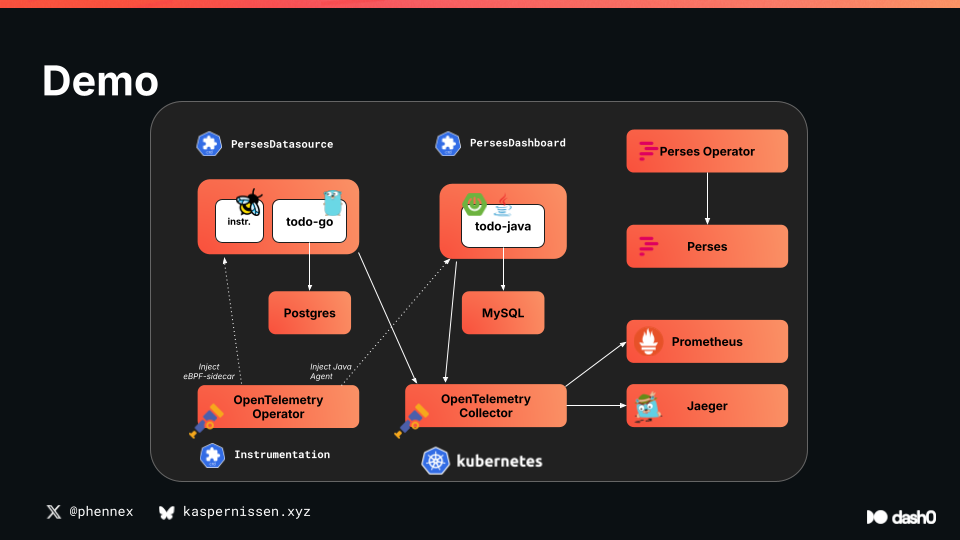

# Container Days Hamburg (September 2025)

A demonstration of modern observability stack featuring OpenTelemetry, Prometheus, Jaeger, OpenSearch, and Perses for dashboard-as-code. This demo showcases automatic instrumentation of microservices with complete telemetry pipeline including metrics, traces, and logs.

## Architecture Overview

This demo deploys a complete cloud-native observability stack on Kubernetes using Kind:



### Applications
- **frontend**: Frontend that allows for switching backend
- **todo-go**: Go REST API for todo management with PostgreSQL backend
- **todo-java**: Java Spring Boot REST API with MySQL backend

### Observability Stack
- **OpenTelemetry Operator**: Manages auto-instrumentation
- **OpenTelemetry Collector**: 
  - **Daemonset**: Collects logs, host metrics, and Kubernetes attributes
  - **Deployment**: Receives OTLP data and scrapes Prometheus metrics
- **Storage Backends**:
  - **Prometheus**: Metrics storage and querying
  - **Jaeger**: Distributed tracing backend
  - **OpenSearch**: Log aggregation and search
- **Visualization**:
  - **Perses**: Modern dashboard-as-code platform with Prometheus integration

## Quick Start

### Prerequisites
- Docker
- Kind
- kubectl  
- Helm
- Make
- Dash0 Authorization Token (for external telemetry export)

### 1. Create Kubernetes Cluster
```bash
make cluster
```
This creates a multi-node Kind cluster named `otel` with proper networking configuration.

### 2. Deploy Complete Observability Stack
```bash
export DASH0_AUTH_TOKEN="your-dash0-token"
make deploy-all
```

This single command deploys:
- OpenTelemetry Operator with Go auto-instrumentation enabled
- Perses Operator for dashboard management
- MySQL and PostgreSQL databases
- Prometheus with custom configuration
- Jaeger for distributed tracing
- OpenSearch with dashboards
- OpenTelemetry Collectors (both daemonset and deployment modes)

### 3. Deploy Applications (Without Instrumentation)
```bash
make deploy-k8s
```

At this point, applications are running but producing **no telemetry data**. This demonstrates the baseline state before instrumentation.

### 4. Add Instrumentation Resource
```bash
make instrumentation
```

This creates the OpenTelemetry `Instrumentation` resource, but **applications still won't be instrumented** because the OpenTelemetry Operator uses opt-in instrumentation.

### 5. Enable Auto-Instrumentation (Manual Annotation)
Since auto-instrumentation is opt-in, you need to add annotations to each deployment:

#### For Java Application:
```bash
kubectl patch deployment todo-java -p '{"spec":{"template":{"metadata":{"annotations":{"instrumentation.opentelemetry.io/inject-java":"opentelemetry/instrumentation"}}}}}'
```

#### For Go Application:
```bash
kubectl patch deployment todo-go -p '{"spec":{"template":{"metadata":{"annotations":{"instrumentation.opentelemetry.io/inject-go":"opentelemetry/instrumentation"}}}}}'
```

**Alternative using kubectl edit:**
```bash
# Edit Java deployment
kubectl edit deploy todo-java
# Add: instrumentation.opentelemetry.io/inject-java: "opentelemetry/instrumentation"

# Edit Go deployment  
kubectl edit deploy todo-go
# Add: instrumentation.opentelemetry.io/inject-go: "opentelemetry/instrumentation"
```

### 6. Verify Telemetry Collection

After adding annotations, pods will restart with instrumentation. Generate some traffic using the frontend and verify data collection:

```bash
# port-forward the frontend service and visit localhost:3000 in your browser.
kubectl port-forward svc/frontend 3000:80
```

#### Check Prometheus Metrics:
```bash
kubectl port-forward svc/prometheus 9090:9090
# Visit: http://localhost:9090
# Query: process_runtime_jvm_memory_usage_bytes
```

#### Check Jaeger Traces:
```bash
kubectl port-forward svc/jaeger-query 16686:16686  
# Visit: http://localhost:16686
# Search for traces from todo-go and todo-java services
```

#### Check OpenSearch Logs:
```bash
kubectl port-forward svc/opensearch-dashboards 5601:5601
# Visit: http://localhost:5601
# Username: admin, Password: SecureP@ssw0rd123
```

## Dashboard as Code with Perses

Perses provides a modern alternative to Grafana with native Kubernetes integration and dashboard-as-code capabilities.

### 7. Deploy Perses Datasource
```bash
kubectl apply -f ./perses/prometheus-datasource.yaml
```

This creates a `PersesDatasource` that connects Perses to your Prometheus instance.

### 8. Deploy JVM Dashboard
```bash
kubectl apply -f ./perses/jvm-dashboard.yaml
```

This demonstrates **dashboard-as-code** by deploying a comprehensive JVM metrics dashboard defined entirely in YAML.

### 9. Access Perses Dashboard
```bash
kubectl port-forward svc/perses 8080:8080
# Visit: http://localhost:8080
```

The JVM dashboard includes:
- **CPU Metrics**: Load, utilization, recent usage
- **Memory Metrics**: Usage, limits, committed memory, post-GC memory
- **Thread Metrics**: Thread count and states  
- **Garbage Collection**: Duration and frequency metrics

## Configuration Details

### OpenTelemetry Collector Configuration

The collector deployment includes a **Prometheus receiver** configured for Kubernetes service discovery:

```yaml
prometheus:
  config:
    scrape_configs:
      - job_name: 'kubernetes-pods'
        kubernetes_sd_configs:
          - role: pod
        relabel_configs:
          - source_labels: [__meta_kubernetes_pod_annotation_prometheus_io_scrape]
            action: keep
            regex: true
          - source_labels: [__meta_kubernetes_pod_annotation_prometheus_io_path]
            action: replace
            target_label: __metrics_path__
            regex: (.+)
          - source_labels: [__address__, __meta_kubernetes_pod_annotation_prometheus_io_port]
            action: replace
            regex: ([^:]+)(?::\d+)?;(\d+)
            replacement: $1:$2
            target_label: __address__
```

Applications with these annotations will be automatically discovered:
```yaml
annotations:
  prometheus.io/scrape: "true"
  prometheus.io/path: "/metrics"  
  prometheus.io/port: "3000"
```

### Instrumentation Configuration

The `Instrumentation` resource configures:
- **Exporter**: OTLP endpoint pointing to collector
- **Propagators**: W3C TraceContext and Baggage
- **Sampling**: Always-on sampling for demo purposes
- **Go-specific**: Database statement capture and global instrumentation

## Cleanup

```bash
make delete-cluster
```
